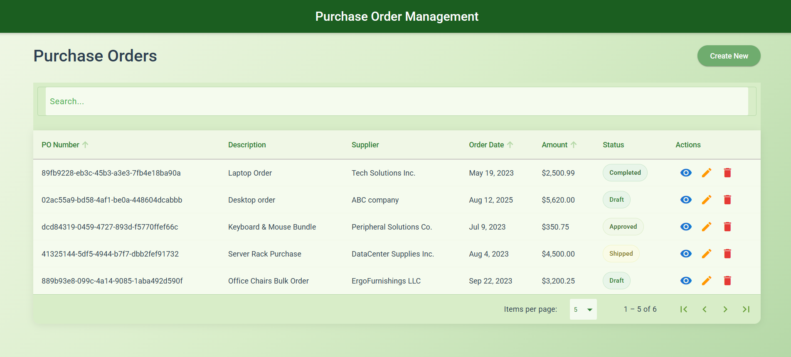
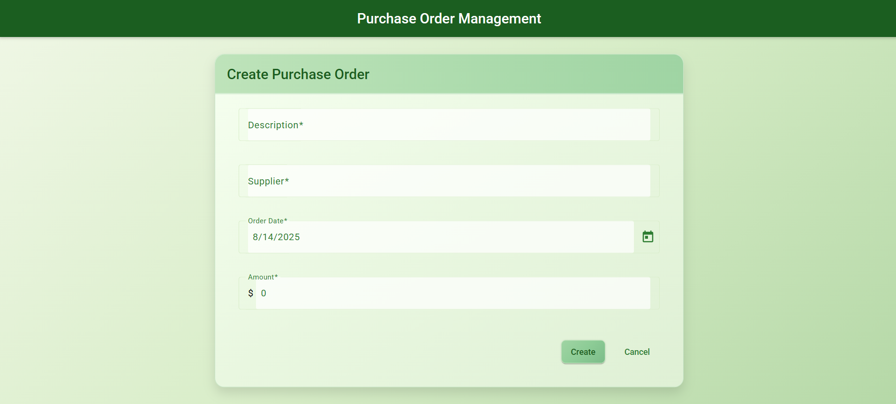
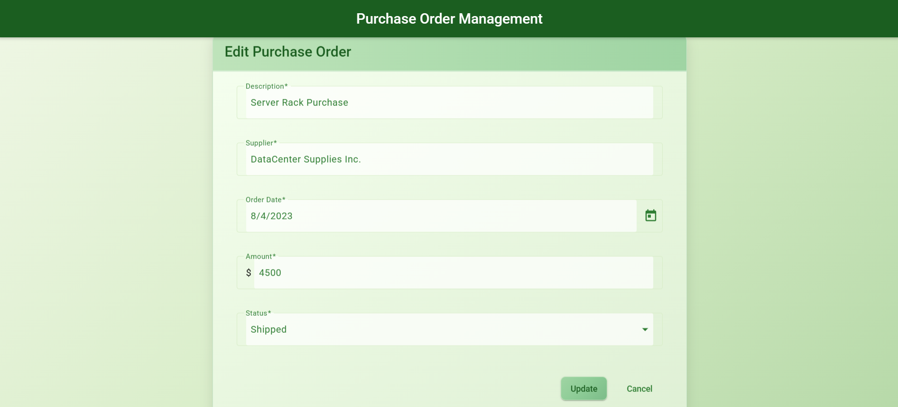

# 📋 Purchase Order Management System


A Clean Architecture implementation of a Purchase Order management system with Angular frontend and .NET Web API.

---

## ✨ Features 

- **📝 Purchase Order CRUD Operations**
  - Create, Read, Update, Delete purchase orders
  - Form validation for all fields
  - Status transition management

- **📊 Data Visualization**
  - Sortable table (PO Number, Order Date, Amount)
  - Filterable by supplier, status, date range
  - Pagination support

---

## 🖼️ Screenshots 

### Order List


### Create a order


### View a order details


### Edit Order


---

## 🛠️ Tech Stack 

| Component       | Technology              |
|-----------------|-------------------------|
| Frontend        | Angular 19              |
| Backend         | .NET 8 Web API          |
| Database        | SQL Server (Code First) |
| UI Components   | Angular Material        |

---
## 🔍 Assumptions

  - Authentication/Authorization is not required (for simplicity)
  - Single user system (no concurrent edit handling)
  - Suppliers are entered as text (not from a separate table)
  - PO Number is generated by the system
  - Basic validation rules (dates in past, positive amounts, etc.)
  - No audit history of changes required
  
---

## 🏗️ Solution Architecture
```bash
├── PurchaseOrderManagement.Core/ # Domain Layer
│ ├── Entities/ # PO.cs, Status enum
│ └── Interfaces/ # Repository contracts
│
├── PurchaseOrderManagement.Infrastructure/ # Data Layer
│ ├── Data/ # DbContext
│ └── Repositories/ # PO Repository
│
├── PurchaseOrderManagement.Application/ # Business Layer
│ ├── DTOs/ # Data Transfer Objects
│ └── Services/ # PO Service
│
├── PurchaseOrderManagement.API/ # Presentation Layer
│ ├── Controllers/ # PO Controller
│ └── Program.cs # DI Configuration
│
└── PurchaseOrderManagement.Web/ # Angular Frontend
├── src/app/features/po/ # Feature Module
└── src/assets/ # Static files

```
---

## ⚙️ Setup Instructions

### 📋 Prerequisites
- Node.js v18+
- .NET 8 SDK
- SQL Server
- Angular CLI 15+
  
### 🚀Installation

1. **Clone the repository**
   ```bash
   git clone https://github.com/SachiniPinnaduwa/Purchase-Order-Management-App.git
   ```
2. **Database Setup**
   ```bash
   cd PurchaseOrderManagement.API
    dotnet ef database update --context AppDbContext
    ```
   
3. **Backend Setup**
   ```
   # Restore packages
   dotnet restore

   # Set connection string in:
   # PurchaseOrderManagement.API/appsettings.Development.json
   {
     "ConnectionStrings": {
     "DefaultConnection": "Server=.;Database=PurchaseOrderDB;Trusted_Connection=True;"
      }
   }
   ```

4. **Frontend Setup**
    ```bash 
    cd PurchaseOrderManagement.Web
    npm install
    
    # Configure API base URL
    # src/environments/environment.ts
    export const environment = {
      production: false,
      apiUrl: 'https://localhost:7079/api'
    };
     ```

5. **🚀 Running the Application**
     ```bash 
      # Terminal 1: Run API
      dotnet run --project PurchaseOrderManagement.API
  
      # Terminal 2: Run Angular
      ng serve --project PurchaseOrderManagement.Web
    ```
6. **🌐 Access:**
   - Frontend: http://localhost:4200
   - Swagger: https://localhost:7079/swagger

---

## 🔌 API Endpoints 

| Method | Endpoint                     | Description                   |
|--------|------------------------------|-------------------------------|
| GET    | `/api/purchaseorders`        | Get all purchaseorders        |
| GET    | `/api/purchaseorders/{id}`   | Get single purchaseorder      |
| POST   | `/api/purchaseorders`        | Add new purchaseorder         |
| PUT    | `/api/purchaseorders/{id}`   | Update purchaseorders         |
| DELETE | `/api/purchaseorders/{id}`   | Delete purchaseorders         |
